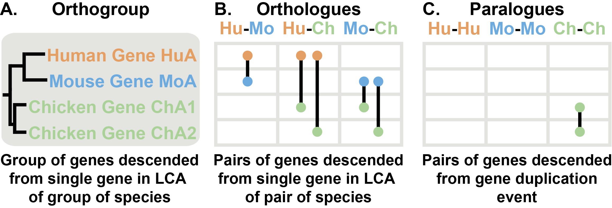

# OrthoFinder — Accurate inference of orthogroups, orthologues, gene trees and rooted species tree made easy!

*Figure 1: Automatic OrthoFinder analysis*

## What does OrthoFinder do?
OrthoFinder is a fast, accurate and comprehensive analysis tool for comparative genomics. It finds **orthologues** and **orthogroups** infers **rooted gene trees** for all orthogroups and infers a **rooted species tree** for the species being analysed. OrthoFinder also provides **comprehensive statistics** for comparative genomic analyses. OrthoFinder is simple to use and all you need to run it is a set of protein sequence files (one per species) in FASTA format.

For more details see the OrthoFinder paper below.

Emms, D.M. and Kelly, S. **(2015)** _OrthoFinder: solving fundamental biases in whole genome comparisons dramatically improves orthogroup inference accuracy._ **Genome Biology** 16:157

https://genomebiology.biomedcentral.com/articles/10.1186/s13059-015-0721-2

## Contents
* [What are orthogroups, orthologues & paralogues?](#orthogroups-orthologues--paralogues)
* [Why use orthogroups in your analysis](#why-orthogroups)
* [Installing OrthoFinder](#setting-up-orthofinder)
* [Running OrthoFinder](#running-orthofinder)
* [OrthoFinder results files and statistics](#results-files)
* [Adding and removing species from a completed OrthoFinder run](#advanced-usage)
* [Preparing and using seperately run BLAST files](#running-blast-searches-separately--p-option)

### Orthogroups, Orthologues & Paralogues
'Orthologue' is a term that applies to genes from two species. Orthologues are pairs of genes that descended from a single gene in the last common ancestor (LCA) of two species (Figure 2A & B). An orthogroup is the natural extension of the concept of orthology to groups of species. An orthogroup is the group of genes descended from a single gene in the LCA of a group of species (Figure 2A). 
When looking at the gene tree, the first divergence between the genes in an orthogroup is a speciation event and the same is true for orthologues.  

As a result of gene duplication events, it is possible to have multiple genes from the same species with both orthologues and orthogroups. In the example (Figure 2A & B), the human gene HuA has two genes that are orthologues of it in chicken, ChA1 and ChA2. Looking again at the orthogroup, we see that there are two chicken genes (Figure 2A) but only one gene from mouse and human. Some authors refer to the genes ChA1 and ChA2 as co-orthologues of HuA to emphasise the fact that there are multiple orthologues. These genes are nevertheless still orthologues and so we will usually just use this broader term. In fact, gene duplication events are so common that in addition to the one-to-many relationship implied by the term 'co-orthologues', there are frequently many-to-many relationships between orthologues. All of these relationships are identified by an OrthoFinder analysis.

Gene duplication events give rise to paralogues. Paralogues are pairs of genes that diverged from a single gene at a gene duplication event. The two chicken genes ChA1 and ChA2 are paralogues (Figure 2A & C). Two genes from different species can also be paralogues if they diverged from one another at a gene duplication event, although there are no examples of this in Figure 2. Since all branching events in a gene tree are either speciation events (that give rise to orthologues) or duplication events (that give rise to paralogues), any genes in the same orthogroup that are not orthologues must necessarily be paralogues.

*Figure 2: Orthologues, Orthogroups & Paralogues*

### Why Orthogroups
If you followed the explanations above it will be clear that an orthogroup is just a gene family/clade of genes defined at a specific taxonomic level—namely, those genes descended from a single gene at the time of the LCA. Some may regard this definition of an orthogroup as unsatisfactory since an orthogroup can contain genes that are paralogues of one another (ChA1 is a paralogue of ChA2 in Figure 2). However, this definition of an orthogroup is the only logically consistent way of extending the concept of orthology to multiple species. If there have been gene duplication events it is not possible to create a group of genes containing all orthologues and only orthologues—try it with the example above! 

One can still identify orthologues between the genes in each pair of species though, but the orthogroup is the correct unit of comparison when considering the group of species as a whole. In fact, one use for orthogroups is for identifying orthologues: The canonical way to identify orthologues is using a gene tree, and an orthogroup is exactly the set of genes that need to be in a the gene tree in order to identify all orthologues. This is the method used by OrthoFinder.

## Setting Up OrthoFinder
OrthoFinder runs on Linux and Mac, setup instructions are given below.

### Set Up
1. Download the latest release from github: https://github.com/davidemms/OrthoFinder/releases (for this example we will assume it is OrthoFinder-1.0.6.tar.gz, change this as appropriate.)

2. In a terminal, 'cd' to where you downloaded the package 

3. Extract the files: `tar xzf OrthoFinder-1.0.6.tar.gz`

4. Test you can run OrthoFinder: `OrthoFinder-1.0.6/orthofinder -h`. OrthoFinder should print its 'help' text. 

To perform an analysis OrthoFinder requires some dependencies to be installed and in the system path (only the first two are needed to infer orthogroups and all four are needed to infer orthologues and gene trees as well):

1. DIAMOND or MMseqs2 (recommended, although BLAST+ can be used instead) 

2. The MCL graph clustering algorithm 

3. FastME (The appropriate version for your system, e.g. 'fastme-2.1.5-linux64', should be renamed `fastme', see instructions below.) 

Brief instructions are given below although users can refer to the installation notes provided with these packages for more detailed instructions. 

### Dependencies
Each of the following packages provide their own detailed instructions for installation, here we give a concise guide.

#### DIAMOND
Available here: https://github.com/bbuchfink/diamond/releases

Download the the latest release, extract it and copy the executable to a directory in your system path, e.g.:
- `wget https://github.com/bbuchfink/diamond/releases/download/v0.9.22/diamond-linux64.tar.gz`
- `tar xzf diamond-linux64.tar.gz`
- `sudo cp diamond /usr/local/bin`

or alternaitvely if you don't have root privileges, instead of the last step above, add the directory containing the directory to your PATH variable. 
E.g 
- `mkdir ~/bin`
- `cp diamond ~/bin`
- ``export PATH=$PATH:~/bin/``

#### MMseqs2
Available here: https://github.com/soedinglab/MMseqs2/releases

Download the appropriate version for your machine, extract it and copy the executable to a directory in your system path, e.g.:
- `wget https://github.com/soedinglab/MMseqs2/releases/download/3-be8f6/MMseqs2-Linux-AVX2.tar.gz`
- `tar xzf MMseqs2-Linux-AVX2.tar.gz`
- `sudo cp mmseqs2/bin/mmseqs /usr/local/bin`

or alternaitvely if you don't have root privileges, isntead of the last step above, add the directory containing the directory to your PATH variable 
- ``export PATH=$PATH:`pwd`/mmseqs2/bin/``

#### MCL
The mcl clustering algorithm is available in the repositories of some Linux distributions and so can be installed in the same way as any other package. For example, on Ubuntu, Debian, Linux Mint:
- `sudo apt-get install mcl`

Alternatively it can be built from source which will likely require the 'build-essential' or equivalent package on the Linux distribution being used. Instructions are provided on the MCL webpage, http://micans.org/mcl/.  

#### FastME
FastME can be obtained from http://www.atgc-montpellier.fr/fastme/binaries.php. The package contains a 'binaries/' directory. Choose the appropriate one for your system and copy it to somewhere in the system path e.g. '/usr/local/bin'** and name it 'fastme'. I.e.:

- `sudo cp fastme-2.1.5-linux64 /usr/local/bin/fastme`

#### Optional: BLAST+ 
NCBI BLAST+ is available in the repositories from most Linux distributions and so can be installed in the same way as any other package. For example, on Ubuntu, Debian, Linux Mint:
- `sudo apt-get install ncbi-blast+`

Alternatively, instructions are provided for installing BLAST+ on Mac and various flavours of Linux on the "Standalone BLAST Setup for Unix" page of the BLAST+ Help manual currently at http://www.ncbi.nlm.nih.gov/books/NBK1762/. Follow the instructions under "Configuration" in the BLAST+ help manual to add BLAST+ to the PATH environment variable.

### Running OrthoFinder
Once the required dependencies have been installed, try running OrthoFinder on the example data:

- `OrthoFinder-1.0.6/orthofinder -f ExampleDataset -S diamond`

Assuming everything was successful OrthoFinder will end by printing the location of the results files, a short paragraph providing a statistical summary and the OrthoFinder citation. If you make use of OrthoFinder for any of your work then please cite it as this helps support future development. 

If you have problems with this standalone binary version of OrthoFinder you can use the python source code version, which has a name of the form, 'OrthoFinder-1.0.6_source.tar.gz' and is available from the github 'releases tab'. See Section 'Python Source Code Version'.

### Setup for advanced use
The following steps are not required for the standard OrthoFinder use cases and are only needed if you want to run the 'trees_from_MSA' utility or you want to run OrthoFinder using the python source code version.

#### Trees from MSA
To use the trees_from_MSA utility there are two additional dependencies which should be installed and in the system path:

1. MAFFT
2. FastTree 

#### Python Source Code Version
It is recommended that you use the standalone binaries for OrthoFinder which do not require python or scipy to be installed. However, the python source code version is available from the github 'releases' page (e.g. 'OrthoFinder-1.0.6_source.tar.gz' and requires python 2.7 and scipy to be installed. Up-to-date and clear instructions are provided here: http://www.scipy.org/install.html, be sure to chose a version using python 2.7. As websites can change, an alternative is to search online for "install scipy". 

## Performing Your Own OrthoFinder Analysis
Performing a complete OrthoFinder analysis is simple:

1. Download the amino acid sequences, in FASTA format, for the species you want to analyse. If you have the option, it is best to use a version containing a single representative/longest transcript-variant for each gene.
2. Optionally, you may want to rename the files to something simple since the filenames will be used as species identifiers in the results. E.g if you were using the 'Homo_sapiens.GRCh38.pep.all.fa' file you could rename it to 'Homo_sapiens.fa' or 'Human.fa'.
3. Place the FASTA files all in a single directory.
4. To perform a complete OrthoFinder analysis requires just one command: 
`orthofinder -f fasta_files_directory [-t number_of_threads]`

The argument 'number_of_threads' is an optional argument to specify the number of parallel threads to use for the BLAST searches, tree inference and reconciliation. As the BLAST queries can be a time-consuming step it is best to use at least as many BLAST processes as there are CPUs on the machine. 

The OrthoFinder run will finish by printing the location of the results files, a short paragraph providing a descriptive statistical summary and the OrthoFinder citation. If you make use of OrthoFinder for any of your work then please cite it as this helps justify OrthoFinder support and future development. The OrthoFinder results files are described in the section "Results Files".

## Results Files
A standard OrthoFinder run produces a set of files describing the orthogroups, orthologues and gene trees for the set of species being analysed. Their locations are given at the end of an OrthoFinder run.

### Results Files: Orthogroups
OrthoFinder generates the main orthogroup file, 'Orthogroups.csv', and two supporting files:

1. **Orthogroups.csv** is a tab separated text file. Each row contains the genes belonging to a single orthogroup. The genes from each orthogroup are organized into columns, one per species.

2. **Orthogroups_UnassignedGenes.csv** is a tab separated text file that is identical in format to Orthogroups.csv but contains all of the genes that were not assigned to any orthogroup.

3. **Orthogroups.txt** (legacy format) is a second file containing the orthogroups described in the Orthogroups.csv file but using the OrthoMCL output format. 

### Results Files: Orthogroup Statistics
The statistics calculated from the orthogroup analysis provide the basis for any comparative genomics analysis. They are easily plotted and can also be used for quality control.

1. **Statistics_Overall.csv** is a tab separated text file giving useful statistics from the orthogroup analysis.

2. **Statistics_PerSpecies.csv** is a tab separated text file giving many of the same statistics as the 'Statistics_Overall.csv' file but on a species-by-species basis.

3. **Orthogroups_SpeciesOverlaps.csv** is a tab separated text file containing a matrix of the number of orthogroups shared by each species-pair (i.e. the number of orthogroups which contain at least one gene from each of the species-pairs).

Most of the terms in the files 'Statistics_Overall.csv' and 'Statistics_PerSpecies.csv' are self-explanatory, the remainder are defined below.

- Species-specific orthogroup: An orthogroups that consist entirely of genes from one species.
- G50: The number of genes in the orthogroup such that 50% of genes are in orthogroups of that size or larger.
- O50: The smallest number of orthogroups such that 50% of genes are in orthogroups of that size or larger.
- Single-copy orthogroup: An orthogroup with exactly one gene (and no more) from each species. These orthogroups are ideal for inferring a species tree and many other analyses. 
- Unassigned gene: A gene that has not been put into an orthogroup with any other genes.

### Results Files: Orthologues
The orthologues spreadsheets are contained in sub-directories, one per species. Within these directories is one spreadsheet per species-pair giving all the inferred orthologues between those two species. The spreadsheets contain one column for the genes from one species and one column for genes from the other species. Orthologues can be one-to-one, one-to-many or many-to-many depending on the gene duplication events since the orthologues diverged (see Section "Orthogroups, Orthologues & Paralogues" for more details). Each set of orthologues is cross-referenced to the orthogroup that contains them.

### Results Files: Gene Trees and Species Tree
The gene trees for each orthogroup and the rooted species tree are in newick format and can be viewed using programs such as Dendroscope (http://dendroscope.org/) or FigTree (http://tree.bio.ed.ac.uk/software/figtree/).

## Advanced Usage
OrthoFinder provides a number of options to allow you to incrementally add and remove species.

### Adding Extra Species
OrthoFinder allows you to add extra species without re-running the previously computed BLAST searches:

- `orthofinder -b previous_orthofinder_directory -f new_fasta_directory`

This will add each species from the 'new_fasta_directory' to existing set of species, reuse all the previous BLAST results, perform only the new BLAST searches required for the new species and recalculate the orthogroups. The 'previous_orthofinder_directory' is the OrthoFinder 'WorkingDirectory/' containing the file 'SpeciesIDs.txt'.

### Removing Species
OrthoFinder allows you to remove species from a previous analysis. In the 'WorkingDirectory/' from a previous analysis there is a file called 'SpeciesIDs.txt'. Comment out any species to be removed from the analysis using a '#' character and then run OrthoFinder using: 

- `orthofinder -b previous_orthofinder_directory`

where 'previous_orthofinder_directory' is the OrthoFinder 'WorkingDirectory/' containing the file 'SpeciesIDs.txt'.

### Adding and Removing Species Simultaneously
The previous two options can be combined, comment out the species to be removed as described above and use the command:
- `orthofinder -b previous_orthofinder_directory -f new_fasta_directory`

### Inferring MSA Gene Trees (to be replaced)
**This functionality is to be incorporated into the main 'orthofinder' program, replacing the 'trees_from_MSA' utility.**

The 'trees_from_MSA' utility will automatically generate multiple sequence alignments and gene trees for each orthogroup generated by OrthoFinder. For example, once OrthoFinder has been run on the example dataset, trees_from_MSA can be run using:

- `trees_from_MSA orthofinder_results_directory [-t number_of_threads]`

This will use MAFFT to generate the multiple sequence alignments and FastTree to generate the gene trees. Both of these programs need to be installed and in the system path.

### Parallelising OrthoFinder Algorithm (-a option)
There are two separate options for controlling the parallelisation of OrthoFinder. The '-t' option should always be used whereas RAM requirements may affect whether you use the '-a' option or not.

- **'-t number_of_threads'**:
This option should always be used. It makes the BLAST searches, the tree inference and gene-tree reconciliation run in parallel. These are all highly-parallelisable and the BLAST searches in particular are by far the most time-consuming task. You should use as many threads as there are cores available.

- **'-a number_of_orthofinder_threads'**
The remainder of the algorithm, beyond these highly-parallelisable tasks, is relatively fast and efficient and so this option has less overall effect. It is most useful when running OrthoFinder using pre-calculated BLAST results since the time savings will be more noticeable in this case. Using this option will also increase the RAM requirements (see manual for more details).

### Running BLAST Searches Separately (-op option)
The '-op' option will prepare the files in the format required by OrthoFinder and print the set of BLAST commands that need to be run. 
- `orthofinder -f fasta_files_directory -op`

This is useful if you want to manage the BLAST searches yourself. For example, you may want to distribute them across multiple machines. Once the BLAST searches have been completed the orthogroups can be calculated using the '-b' command as described in Section "Using Pre-Computed BLAST Results".

### Using Pre-Computed BLAST Results
It is possible to run OrthoFinder with pre-computed BLAST results provided they are in the correct format. They can be prepared in the correct format using the '-op' command and, equally, the files from a previous OrthoFinder run are also in the correct format to rerun using the '-b' option. The command is simply:

- `orthofinder -b directory_with_processed_fasta_and_blast_results`

If you are running the BLAST searches yourself it is strongly recommended that you use the '-op' option to prepare the files first (see Section "Running BLAST Searches Separately"). Should you need to prepare them manually, the required files and their formats are described in the appendix of the PDF Manual (for example, if you already have BLAST search results from another source and it will take too much computing time to redo them).

### Regression Tests
A set of regression tests are included in the directory 'Tests' available from the github repository. They can be run by calling the script 'test_orthofinder.py'. They currently require version 2.2.28 of NCBI BLAST and the script will exit with an error message if this is not the case.
