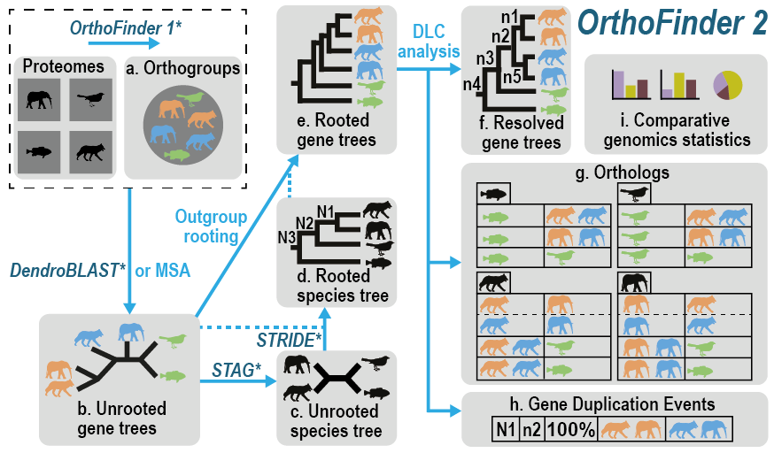
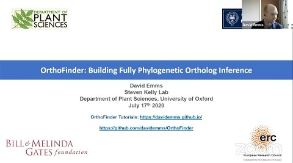
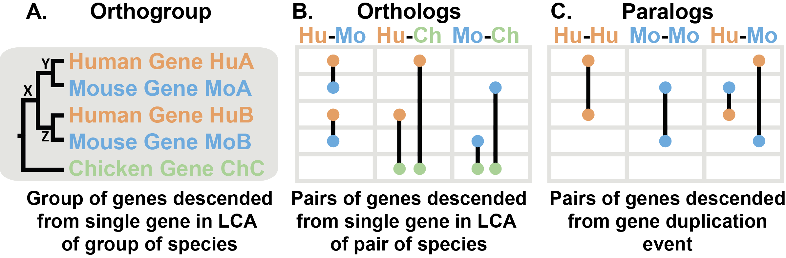

# Check out the new OrthoFinder tutorials: https://davidemms.github.io/

 1. Downloading and running OrthoFinder

2. Running an example OrthoFinder analysis

3. Exploring OrthoFinder's results

4. OrthoFinder best practices

---

# OrthoFinder: phylogenetic orthology inference for comparative genomics


*Figure 1: Automatic OrthoFinder analysis*

## What does OrthoFinder do?
OrthoFinder is a fast, accurate and comprehensive platform for comparative genomics. It finds **orthogroups** and **orthologs**, infers **rooted gene trees** for all orthogroups and identifies all of the **gene duplication events** in those gene trees. It also infers a **rooted species tree** for the species being analysed and maps the gene duplication events from the gene trees to branches in the species tree. OrthoFinder also provides **comprehensive statistics** for comparative genomic analyses. OrthoFinder is simple to use and all you need to run it is a set of protein sequence files (one per species) in FASTA format.

For more details see the OrthoFinder papers below.

[Emms, D.M. and Kelly, S. **(2019)** _OrthoFinder: phylogenetic orthology inference for comparative genomics._ **Genome Biology** 20:238](https://genomebiology.biomedcentral.com/articles/10.1186/s13059-019-1832-y)

[Emms, D.M. and Kelly, S. **(2015)** _OrthoFinder: solving fundamental biases in whole genome comparisons dramatically improves orthogroup inference accuracy._ **Genome Biology** 16:157](https://genomebiology.biomedcentral.com/articles/10.1186/s13059-015-0721-2)

You can see an overview talk for OrthoFinder from the 2020 Virtual symposium on Phylogenomics and Comparative Genomics here:

[](https://www.youtube.com/watch?v=L6eXJAE5J7g "OrthoFinder: Building Fully Phylogenetic Orthology Inference")

Thanks to Rosa Fernández & Jesus Lozano-Fernandez for organising this excellent conference.

## Getting started with OrthoFinder
You can find a step-by-step tutorial here: [Downloading and checking OrthoFinder](https://davidemms.github.io/orthofinder_tutorials/downloading-and-checking-orthofinder.html) including **instructions for Mac**, for which Bioconda is recommended and **Windows**, for which the Windows Subsystem for Linux is recommended. There are also tutorials on that site which guide you through running your first analysis and exploring the results files. 

### Installing OrthoFinder on Linux
You can install OrthoFinder using Bioconda or download it directly from GitHub. These are the instructions for direct download, see the tutorials for other methods.

1. Download the latest release from github: https://github.com/davidemms/OrthoFinder/releases 
    * If you have python installed and the numpy and scipy libraries then download **OrthoFinder_source.tar.gz**.
    * If not then download the larger bundled package, **OrthoFinder.tar.gz**.

2. In a terminal, 'cd' to where you downloaded the package 

3. Extract the files: `tar xzf OrthoFinder_source.tar.gz`  or `tar xzf OrthoFinder.tar.gz`

4. Test you can run OrthoFinder: `python OrthoFinder_source/orthofinder.py -h` or `./OrthoFinder/orthofinder -h`. OrthoFinder should print its 'help' text. 

5. That's it! You can now run OrthoFinder on a directory of protein sequence fasta files: e.g. `./OrthoFinder/orthofinder -f /OrthoFinder/ExampleData/`

If you want to move the orthofinder executable to another location then you must also place the accompanying config.json file and bin/ directory in the same directory as the orthofinder executable.

OrthoFinder is written in python, but the bundled version does not require python to be installed on your computer. Both versions contain the programs OrthoFinder needs in order to run (in bin/), it will use these copies in preference to any of the same programs in your system path. You can delete the individual executables if you would prefer it not to do this. 

#### Installing OrthoFinder on Mac & Windows

The easiest way to install OrthoFinder on Mac is using Bioconda:

via bioconda: `conda install orthofinder`

The easiest way to run OrthoFinder on Windows is using the Windows Subsystem for Linux or Docker: [davidemms/orthofinder](https://hub.docker.com/r/davidemms/orthofinder): 

```
docker pull davidemms/orthofinder
docker run -it --rm davidemms/orthofinder orthofinder -h
docker run --ulimit nofile=1000000:1000000 -it --rm -v /full/path/to/fastas:/input:Z davidemms/orthofinder orthofinder -f /input
```

A more complete guide can be found here: <https://davidemms.github.io/orthofinder_tutorials/alternative-ways-of-getting-OrthoFinder.html>. Note that running OrthoFinder on Windows in a docker containner will not be as fast as running it natively.

## Running OrthoFinder
To run OrthoFinder on the Example Data type:

`OrthoFinder/orthofinder -f OrthoFinder/ExampleData`

To run on your own dataset, replace "OrthoFinder/ExampleData" with the directory containing your input fasta files, with one file per species. OrthoFinder will look for input fasta files with any of the following filename extensions:
* .fa
* .faa
* .fasta
* .fas
* .pep

## What OrthoFinder provides
**There is a tutorial that provides a guided tour of the main results files here: <https://davidemms.github.io/orthofinder_tutorials/exploring-orthofinders-results.html>**

A standard OrthoFinder run produces a set of files describing the orthogroups, orthologs, gene trees, resolve gene trees, the rooted species tree, gene duplication events and comparative genomic statistics for the set of species being analysed. These files are located in an intuitive directory structure.

### Results Files: Phylogenetic Hierarchical Orthogroups Directory
From version 2.4.0 onwards OrthoFinder infers HOGs, orthogroups at each hierarchical level (i.e. at each node in the species tree) by analysing the rooted gene trees. This is a far more accurate orthogroup inference method than the gene similarity/graph based approach used by all other methods and used previously by OrthoFinder (the deprecated Orthogroups/Orthogroups.tsv file). According to the Orthobench benchmarks, these new orthogroups are 12% more accurate than the OrthoFinder 2 orthogroups (Orthogroups/Orthogroups.tsv). The accuracy can be increased still further (20% more accurate on Orthobench) by including outgroup species, which help with the interpretation of the rooted gene trees. 

It is important to ensure that the species tree OrthoFinder is using is accurate so as to maximise the accuracy of the HOGs. To reanalyse with a different species tree use the options `-ft PREVIOUS_RESULTS_DIR -s SPECIES_TREE_FILE`. This runs just the final analysis steps "from trees" and is relatively quick. If outgroup species are used, refer to "Species_Tree/SpeciesTree_rooted_node_labels.txt" to determine which N?.tsv file that contains the orthogroups you require. 

1. **N0.tsv** is a tab separated text file. Each row contains the genes belonging to a single orthogroup. The genes from each orthogroup are organized into columns, one per species. Additional columns give the HOG (Hierarchical Orthogroup) ID and the node in the gene tree from which the HOG was determined (note, this can be above the root of the clade containing the genes). **This file effectively replaces the orthogroups in Orthogroups/Orthogroups.tsv** from Markov clustering using MCL. 

2. **N1.txt, N2.tsv, ...**: Orthogroups inferred from the gene trees corresponding to the clades of species in the species tree N1, N2, etc. Because OrthoFinder now infers orthogroups at every hierarchical level within the species tree, it is now possible to include outgroup species within the analysis and then use the HOG files to get the orthogroups defined for your chosen clade within the species tree. 

(Hierarchical orthogroup splitting: When analysing the gene trees, a nested hierarchical group (any HOG other than N0, the HOG at the level of the last common ancestor of all species) may sometimes have lost its genes from the earliest diverging species and then duplicated before the first extant genes. The two first diverging clades will then be paralogous even though the evidence suggests they belong to the same HOG. For most analyses it is often better to split these clades into separate groups. This can be requested using the option '**-y**'.)

### Results Files: Orthologues Directory 
The Orthologues directory contains one sub-directory for each species that in turn contains a file for each pairwise species comparison, listing the orthologs between that species pair. Orthologues can be one-to-one, one-to-many or many-to-many depending on the gene duplication events since the orthologs diverged (see Section "Orthogroups, Orthologues & Paralogues" for more details). Each row in a file contains the gene(s) in one species that are orthologues of the gene(s) in the other species and each row is cross-referenced to the orthogroup that contains those genes. 

### Results Files: Orthogroups Directory (deprecated)
**The orthogroups in Phylogenetic_Hierarchical_Orthogroups/ should be used instead.** They are identifed using rooted genes trees and are 12%-20% more accurate.

1. **Orthogroups.tsv (deprecated)** is a tab separated text file. Each row contains the genes belonging to a single orthogroup. The genes from each orthogroup are organized into columns, one per species. **The orthogroups in Phylogenetic_Hierarchical_Orthogroups/N0.tsv should be used instead.** 

2. **Orthogroups_UnassignedGenes.tsv** is a tab separated text file that is identical in format to Orthogroups.csv but contains all of the genes that were not assigned to any orthogroup.

3. **Orthogroups.txt** (legacy format) is a second file containing the orthogroups described in the Orthogroups.tsv file but using the OrthoMCL output format. 

4. **Orthogroups.GeneCount.tsv** is a tab separated text file that is identical in format to Orthogroups.csv but contains counts of the number of genes for each species in each orthogroup.

5. **Orthogroups_SingleCopyOrthologues.txt** is a list of orthogroups that contain exactly one gene per species i.e. they contain one-to-one orthologues. They are ideally suited to between-species comparisons and to species tree inference. 

### Results Files: Gene Trees Directory
1. A rooted phylogenetic tree inferred for each orthogroup with 4 or more sequences (4 sequences is the mimimum number required for tree inference with most tree inference programs).

### Results Files: Resolved Gene Trees Directory
1. A rooted phylogenetic tree inferred for each orthogroup with 4 or more sequences and resolved using the OrthoFinder hybrid species-overlap/duplication-loss coalescent model.

### Results Files: Species Tree Directory
1. **SpeciesTree_rooted.txt** A STAG species tree inferred from all orthogroups, containing STAG support values at internal nodes and rooted using STRIDE.

2. **SpeciesTree_rooted_node_labels.txt** The same tree as above but with the nodes given labels (instead of support values) to allow other results files to cross-reference branches/nodes in the species tree (e.g. location of gene duplication events).

### Results Files: Comparative Genomics Statistics Directory
1. **Duplications_per_Orthogroup.tsv** is a tab separated text file that gives the number of duplications identified in each orthogroup. This master file for this data is Gene_Duplication_Events/Duplications.tsv.

2. **Duplications_per_Species_Tree_Node.tsv** is a tab separated text file that gives the number of duplications identified as occurring along each branch of the species tree. This master file for this data is Gene_Duplication_Events/Duplications.tsv.

3. **Orthogroups_SpeciesOverlaps.tsv** is a tab separated text file that contains the number of orthogroups shared between each species-pair as a square matrix.

4. **OrthologuesStats_*.tsv files** are tab separated text files containing matrices giving the numbers of orthologues in one-to-one, one-to-many and many-to-many relationships between each pair of species.

    * ***OrthologuesStats_one-to-one.tsv*** is the number of one-to-one orthologues between each species pair. 

    * ***OrthologuesStats_many-to-many.tsv*** contains the number of orthologues in a many-to-many relationship for each species pair (due to gene duplication events in both lineages post-speciation). Entry (i,j) is the number of genes in species i that are in a many-to-many orthology relationship with genes in species j.

    * ***OrthologuesStats_many-to-one.tsv***: entry (i,j) gives the number of genes in species i that are in a one-to-many orthology relationship with genes from species j. There is a walk-through of an example results file here: https://github.com/davidemms/OrthoFinder/issues/259.

    * ***OrthologuesStats_one-to-many.tsv***: entry (i,j) gives the number of genes in species i that are in a many-to-one orthology relationship with a gene from species j. There is a walk-through of an example results file here: https://github.com/davidemms/OrthoFinder/issues/259.

    * ***OrthologuesStats_Total.tsv*** contains the totals for each species pair of orthologues of whatever multiplicity. Entry (i,j) is the total number of genes in species i that have orthologues in species j.

5. **Statistics_Overall.tsv** is a tab separated text file that contains general statistics about orthogroup sizes and proportion of genes assigned to orthogroups.

6. **Statistics_PerSpecies.tsv** is a tab separated text file that contains the same information as the Statistics_Overall.csv file but for each individual species.

Most of the terms in the files 'Statistics_Overall.csv' and 'Statistics_PerSpecies.csv' are self-explanatory, the remainder are defined below.

- Species-specific orthogroup: An orthogroups that consist entirely of genes from one species.
- G50: The number of genes in the orthogroup such that 50% of genes are in orthogroups of that size or larger.
- O50: The smallest number of orthogroups such that 50% of genes are in orthogroups of that size or larger.
- Single-copy orthogroup: An orthogroup with exactly one gene (and no more) from each species. These orthogroups are ideal for inferring a species tree and many other analyses. 
- Unassigned gene: A gene that has not been put into an orthogroup with any other genes.

### Results Files: Gene Duplication Events Directory
1. **Duplications.tsv** is a tab separated text file that lists all the gene duplication events identified by examining each node of each orthogroup gene tree. The columns are "Orthogroup", "Species Tree node" (branch of the species tree on which the duplication took place, see Species_Tree/SpeciesTree_rooted_node_labels.txt), "Gene tree node" (node corresponding to the gene duplication event, see corresponding orthogroup tree in Resolved_Gene_Trees/); "Support" (proportion of expected species for which both copies of the duplicated gene are present); "Type" ("Terminal": duplication on a terminal branch of the species tree, "Non-Terminal": duplication on an internal branch of the species tree & therefore shared by more than one species, "Non-Terminal: STRIDE": Non-Terminal duplication that also passes the very stringent [STRIDE](https://www.ncbi.nlm.nih.gov/pmc/articles/PMC5850722/) checks for what the topology of the gene tree should be post-duplication); "Genes 1" (the list of genes descended from one of the copies of the duplicate gene), "Genes 2" (the list of genes descended from the other copy of the duplicate gene.

2. **SpeciesTree_Gene_Duplications_0.5_Support.txt** provides a summation of the above duplications over the branches of the species tree. It is a text file in newick format. The numbers after each node or species name are the number of gene duplication events with at least 50% support that occurred on the branch leading to the node/species. The branch lengths are the standard branch lengths, as give in Species_Tree/SpeciesTree_rooted.txt.

### Results Files: Orthogroup Sequences
1. A FASTA file for each orthogroup giving the amino acid sequences for each gene in the orthogroup.

### Results Files: Single Copy Orthologue Sequences
1. The same files as the "Orthogroup Sequences" directory but restricted to only those orthogroups which contain exactly one gene per species.

### Results Files: WorkingDirectory
This contains all the files necessary for orthofinder to run. You can ignore this.

## Additional Information
* [What are orthogroups, orthologs & paralogs?](#orthogroups-orthologs--paralogs)
* [Why use orthogroups in your analysis](#why-orthogroups)
* [Installing Dependencies](#setting-up-orthofinder)
* [Adding and removing species from a completed OrthoFinder run](#advanced-usage)
* [Preparing and using separately run BLAST files](#running-blast-searches-separately--op-option)

## Orthogroups, Orthologs & Paralogs
Figure 2A shows an example gene tree for three species: human, mouse and chicken. Orthologs are pairs of genes that descended from a single gene in the last common ancestor (LCA) of two species (Fig. 2B). They can be thought of as 'equivalent genes' between two species. An orthogroup is the extension of this concept to groups of species. An orthogroup is the group of genes descended from a single gene in the LCA of a group of species (Figure 2A). Genes within an orthogroup may be orthologs of one another or they may be paralogs, as explained below.

The tree shows the evolutionary history of a gene. First, there was a speciation event where the chicken lineage diverged from the human-mouse ancestor. In the human-mouse ancestor, there was a gene duplication event at X producing two copies of the gene in that ancestor, Y & Z. When human and mouse diverged they each inherited gene Y (becoming HuA & MoA) and gene Z (HuB & MoB). In general, we can identify a gene duplication event because it creates two copies of a gene in a species (e.g. HuA & HuB).


*Figure 2: Orthologues, Orthogroups & Paralogues*

To tell which genes are orthologs and which genes are paralogs we need to identify the gene duplciation events in the tree. Orthologs are gene that diverged at a speciation event (e.g HuA & MoA) while paralogs diverged at a gene duplication event (e.g. HuA & MoB, and others: Fig 2C). Because orthologs only diverged at the point when the species diverged, they are as closely related as any gene can be between the two species. Paralogs are more distantly related, they diverged at a gene duplication event in a common ancestor. Such a gene duplication event must have occurred further back in time than when the species diverged and so paralogs between a pair of species are always less closely related than orthologs between that pair of species. Paralogs are also possible within a species (e.g. HuA & HuB).

The chicken gene diverged from the other genes when the lineage leading to chicken split from the lineage leading to human and mouse. Therefore, the chicken gene ChC is an ortholog of HuA & HuB in human and an ortholog of MoA & MoB in mouse. Depending on what happend after the genes diverged, orthologs can be in one-to-one relationships (HuA - MoA), many-to-one (HuA & HuB - ChC), or many-to-many (no examples in this tree, but would occur if there were a duplication in chicken). All of these relationships are identified by OrthoFinder.

## Why Orthogroups
### Orthogroups allow you to analyse all of your data
All of the genes in an orthogroup are descended from a single ancestral gene. Thus, all the genes in an orthogroup started out with the same sequence and function. As gene duplication and loss occur frequently in evolution, one-to-one orthologs are rare and limitation of analyses to on-to-one orthologs limits an analysis to a small fraction of the available data. By analysing orthogroups you can analyse all of your data. 

### Orthogroups allow you to define the unit of comparison
It is important to note that with orthogroups you choose where to define the limits of the unit of comparison. For example, if you just chose to analyse human and mouse in the above figure then you would have two orthogroups. 

### Orthogroups are the only way to identify orthologs
Orthology is defined by phylogeny. It is not definable by amino acid content, codon bias, GC content or other measures of sequence similarity. Methods that use such scores to define orthologs in the absence of phylogeny can only provide guesses. The only way to be sure that the orthology assignment is correct is by conducting a phylogenetic reconstruction of all genes descended from a single gene the last common ancestor of the species under consideration. This set of genes is an orthogroup. Thus, the only way to define orthology is by analysing orthogroups.   

## Setting up OrthoFinder
### Installing Dependencies
To perform an analysis OrthoFinder requires some dependencies. The OrthoFinder release package now contains these so you should just be able to download it and run. 

Here are some brief instructions if you do need to download them manually. They will need to be in the system path, which you can check by using the 'which' command, e.g. `which diamond`. Each of these packages also contains more detailed installation instructions on their websites if you need them.

**Standard workflow:**

1. DIAMOND **or** MMseqs2 (recommended, although BLAST+ can be used instead) 

2. The MCL graph clustering algorithm 

3. FastME (The appropriate version for your system, e.g. 'fastme-2.1.5-linux64', should be renamed `fastme', see instructions below.) 

**MSA workflow:**

4. Multiple sequence alignment program: MAFFT recommended

5. Tree inference program: FastTree* recommended

* FastTree is highly recommended, especially for a first analysis. Note that even a program as fast as IQTREE will take a very large amount of time to run on a reasonable sized dataset. If you intend to do this, it is recommended to try a faster method first (e.g. the standard workflow). Once you've confirmed everything is ok, you can restart the previous analysis from the point where these workflows diverge using the `-M msa` option.

#### DIAMOND
Available here: https://github.com/bbuchfink/diamond/releases

Download the latest release, extract it and copy the executable to a directory in your system path, e.g.:
- `wget https://github.com/bbuchfink/diamond/releases/latest/download/diamond-linux64.tar.gz`
- `tar xzf diamond-linux64.tar.gz`
- `sudo cp diamond /usr/local/bin`

or alternatively if you don't have root privileges, instead of the last step above, add the directory containing the directory to your PATH variable. 
E.g. 
- `mkdir ~/bin`
- `cp diamond ~/bin`
- ``export PATH=$PATH:~/bin/``

#### MCL
The mcl clustering algorithm is available in the repositories of some Linux distributions and so can be installed in the same way as any other package. For example, on Ubuntu, Debian, Linux Mint:
- `sudo apt-get install mcl`

Alternatively, it can be built from source which will likely require the 'build-essential' or equivalent package on the Linux distribution being used. Instructions are provided on the MCL webpage, http://micans.org/mcl/.  

#### FastME
FastME can be obtained from http://www.atgc-montpellier.fr/fastme/binaries.php. The package contains a 'binaries/' directory. Choose the appropriate one for your system and copy it to somewhere in the system path e.g. '/usr/local/bin'** and name it 'fastme'. I.e.:

- `sudo cp fastme-2.1.5-linux64 /usr/local/bin/fastme`

#### Optional: BLAST+ 
BLAST may give 1-2% accuracy increase over DIAMOND, but with a runtime of approximately 20x longer. NCBI BLAST+ is available in the repositories from most Linux distributions and so can be installed in the same way as any other package. For example, on Ubuntu, Debian, Linux Mint:
- `sudo apt-get install ncbi-blast+`

Alternatively, instructions are provided for installing BLAST+ on Mac and various flavours of Linux on the "Standalone BLAST Setup for Unix" page of the BLAST+ Help manual currently at http://www.ncbi.nlm.nih.gov/books/NBK1762/. Follow the instructions under "Configuration" in the BLAST+ help manual to add BLAST+ to the PATH environment variable.

#### Optional: MMseqs2
Available here: https://github.com/soedinglab/MMseqs2/releases

Download the appropriate version for your machine, extract it and copy the executable to a directory in your system path, e.g.:
- `wget https://github.com/soedinglab/MMseqs2/releases/download/3-be8f6/MMseqs2-Linux-AVX2.tar.gz`
- `tar xzf MMseqs2-Linux-AVX2.tar.gz`
- `sudo cp mmseqs2/bin/mmseqs /usr/local/bin`

or alternatively if you don't have root privileges, instead of the last step above, add the directory containing the directory to your PATH variable 
- ``export PATH=$PATH:`pwd`/mmseqs2/bin/``

## Trees from MSA: `"-M msa"`
The following is not required for the standard OrthoFinder use cases and are only needed if you want to infer maximum likelihood trees from multiple sequence alignments (MSA). This is more costly computationally but more accurate. By default, MAFFT is used for the alignment and FastTree for the tree inference. The option for this is, "-M msa". You should be careful using any other tree inference programs, such as IQTREE or RAxML, since inferring the gene trees for the complete set of orthogroups using anything that is not as quick as FastTree will require significant computational resources/time. The executables you wish to use should be in the system path. 

### Adding addtional tree inference, local alignment or MSA programs: config.json
You can actually use **any** alignment or tree inference program you like the best! Be careful with the method you chose, OrthoFinder typically needs to infer about 10,000-20,000 gene trees. If you have many species or if the tree/alignment method isn't super-fast then this can take a very long time! MAFFT + FastTree provides a reasonable compromise. OrthoFinder already knows how to call:
- mafft
- muscle
- iqtree
- raxml
- raxml-ng
- fasttree

For example, to you muscle and iqtree, the command like arguments you need to add are: `"-M msa -A muscle -T iqtree"`

OrthoFinder also knows how to use the following local sequence alignment programs:
- BLAST
- DIAMOND
- MMSeqs2

If you want to use a different program, there is a simple configuration file called **"config.json"** in the orthofinder directory and you can also create a file of the same format called **"config_orthofinder_user.json"** in your user home directory. You just need to add an entry to tell OrthoFinder what the command line looks like for the program you want to use. There are lots of examples in the file that you can follow. The "config.json" file is read first and then the "config_orthofinder_user.json", if it is present. The config_orthofinder_user.json file can be used to add user-specific options and to overwrite options from config.json. In most cases it is best to add additional options to the "config_orthofinder_user.json" since these will continue to apply if you update your version of OrthoFinder.

## Python Source Code Version
There is a standalone binary for OrthoFinder which do not require python or scipy to be installed which is therefore the easiest for many users. However, the python source code version is available from the github 'releases' page (e.g. 'OrthoFinder_source.tar.gz') and requires python 2.7 or python 3 plus scipy & numpy to be installed. Up-to-date and clear instructions for scipy/numpy are provided here: http://www.scipy.org/install.html. As websites can change, an alternative is to search online for "install scipy". 

## Advanced usage
### Adding Extra Species
OrthoFinder allows you to add extra species without re-running the previously computed BLAST searches:

- `orthofinder -b previous_orthofinder_directory -f new_fasta_directory`

This will add each species from the 'new_fasta_directory' to existing set of species, reuse all the previous BLAST results, perform only the new BLAST searches required for the new species and recalculate the orthogroups. The 'previous_orthofinder_directory' is the OrthoFinder 'WorkingDirectory/' containing the file 'SpeciesIDs.txt'.

### Removing Species
OrthoFinder allows you to remove species from a previous analysis. In the 'WorkingDirectory/' from a previous analysis there is a file called 'SpeciesIDs.txt'. Comment out any species to be removed from the analysis using a '#' character and then run OrthoFinder using: 

- `orthofinder -b previous_orthofinder_directory`

where 'previous_orthofinder_directory' is the OrthoFinder 'WorkingDirectory/' containing the file 'SpeciesIDs.txt'.

### Adding and Removing Species Simultaneously
The previous two options can be combined, comment out the species to be removed as described above and use the command:
- `orthofinder -b previous_orthofinder_directory -f new_fasta_directory`

### Inferring Multiple Sequence Alignment (MSA) Gene Trees
Trees can be inferred using  multiple sequence alignments (MSA) by using the option "-M msa". By default MAFFT is used to generate the MSAs and FastTree to generate the gene trees. Alternatively, any other program can be used in place of these. Many popular programs have already been configured by having an entry in the config.json file in the orthofinder directory. All options currently available can be seen by using the option "-h" to see the help file. The config.json file is user-editable to allow for any other desired program to be added. MAFFT, FastTree, or whatever programs are used instead need to be in the system path.

OrthoFinder performs light trimming of the MSA to prevent overly long runtimes & RAM usage caused by very long, gappy alignemnts. A column is trimmed from the alignment if is it greater than 90% gaps and provided two conditions are met. 1. The length of the trimmed alignment cannot go below 500 AA 2. No more than 25% of non-gap characters can be removed from the alignment. If either of these conditions are not met then the threshold for the percentage of gaps in removed columns is progressively increased beyond 90% until both conditions are met. The trimming can be turned off using the option "-z".

### Parallelising OrthoFinder Algorithm 
There are two separate options for controlling the parallelisation of OrthoFinder.

- **'-t number_of_threads'**:
This option should always be used. It specifies the number of parallel processes for the BLAST/DIAMOND searches and tree inference steps. These steps represent most of the runtime and are highly-parallelisable and so you should typically use as many threads as there are cores available on your computer. This is the value it will default to if not specified by the user.

- **'-a number_of_orthofinder_threads'**
In addition to the above, all of the critical internal steps of the OrthoFinder algorithm have been parallelised. The number of threads for these steps is controlled using the '-a' option. These steps typically have larger RAM requirements and so using a value 4-8x smaller than that used for the '-t' option is usually a good choice. Since these steps are a small component of the overall runtime it is not important to set '-a' as high as possible in order to get good performance. Not running out of RAM is a more important consideration. If the '-a' parameter is not set it will default to 16 or one eighth of the '-t' parameter, whichever is smaller.

### Running BLAST Searches Separately (-op option)
The '-op' option will prepare the files in the format required by OrthoFinder and print the set of BLAST commands that need to be run. 
- `orthofinder -f fasta_files_directory -op`

This is useful if you want to manage the BLAST searches yourself. For example, you may want to distribute them across multiple machines. Once the BLAST searches have been completed the orthogroups can be calculated using the '-b' command as described in Section "Using Pre-Computed BLAST Results".

### Using Pre-Computed BLAST Results
It is possible to run OrthoFinder with pre-computed BLAST results provided they are in the correct format. They can be prepared in the correct format using the '-op' command and, equally, the files from a previous OrthoFinder run are also in the correct format to rerun using the '-b' option. The command is simply:

- `orthofinder -b directory_with_processed_fasta_and_blast_results`

If you are running the BLAST searches yourself it is strongly recommended that you use the '-op' option to prepare the files first (see Section "Running BLAST Searches Separately"). Should you need to prepare them manually, the required files and their formats are described in the appendix of the PDF Manual (for example, if you already have BLAST search results from another source and it will take too much computing time to redo them).

### Regression Tests
A set of regression tests are included in the directory 'Tests' available from the github repository. They can be run by calling the script 'test_orthofinder.py'. They currently require version 2.2.28 of NCBI BLAST and the script will exit with an error message if this is not the case.

## Methods
The orthogroup inference stage of OrthoFinder is described in the first paper: https://genomebiology.biomedcentral.com/articles/10.1186/s13059-015-0721-2

The second stage from orthogroups to gene trees, the rooted species tree, orthologs, gene duplication events etc. is described in the second paper: https://genomebiology.biomedcentral.com/articles/10.1186/s13059-019-1832-y

The workflow figure at the top of this page summarises this.

The rooting of the unrooted species tree is described in the STRIDE paper: https://www.ncbi.nlm.nih.gov/pmc/articles/PMC5850722/

Species tree inference is described in the second OrthoFinder paper and in the STAG paper: <https://www.biorxiv.org/content/10.1101/267914v1>. A summary is provided below.

### Species Tree Inference
OrthoFinder infers orthologs from rooted gene trees. Since tree inference methods return unrooted gene trees, OrthoFinder requires a rooted species tree in order to root the gene trees before ortholog inference can take place. There are two methods that can be used for unrooted species tree inference (plus a fallback method that is employed in rare circumstances when there is insufficient data for the other methods). Additionally, if the user knows the topology of the rooted species tree they can provide it to OrthoFinder (the branch lenghts aren't required). The rooted species tree is only required in the final step of the OrthoFinder analysis, the rooting of the gene trees and the inference of orthologs and gene duplication events. This step is comparitively fast and so it is easy to run just this last step using the '-ft' option and a corrected species tree if you want to use a different species tree to the one OrthoFinder used.

#### Default species tree method
The default species tree method is STAG, described here: <https://www.biorxiv.org/content/10.1101/267914v1>
1. The set of all orthogroups with all species present (regardless of gene copy number) is identified: X
2. For each orthogroup x in X, a matrix of pairwise species distances is calculated. For x, the distance between each species pair is the tree distance for the closest pair of genes from that species pair in the gene tree for x.
3. For each orthogroup x in X, a species tree is inferred from the distance matrix.
4. A consensus tree of all these individual species trees is calculated as the final species tree
5. The support value for each bipartition is the number of individual  species trees that contained that bipartition. 
6. When it is run, OrthoFinder outputs how many orthogroups it has identified with all species present. E.g. for the example dataset: 
> 269 trees had all species present and will be used by STAG to infer the species tree

#### Multiple Sequence Alignment species tree method (-M msa)
The MSA species tree method is also described in the STAG paper: <https://www.biorxiv.org/content/10.1101/267914v1>, it is used whenever the MSA method is used for tree inference using the '-M msa' option. It infers the species tree from a concatenated MSA of single-copy genes. For many datasets there will not be many orthogroups that have exactly one gene in every species since gene duplication and loss events make such orthogroups rare. For this reason, OrthoFinder will identify orthogroups that are single-copy in a proportion (p%) of species and use the single-copy genes from these orthogroups as additional data to infer the species tree. This is standard practice in most papers in which a species tree is inferred. OrthoFinder provides a formalised procedure for determining a suitable value of p. Let S be the number of species.
1. Identify n, the number of orthogroups with exactly one gene in s species, where s is initially equal to S, the number of species in the analysis. If n >= 1000 stop here and use these orthogroups
2. While n < 1000
 * set s = s-1
 * recalculate n, number of orthogroups with at least s species single-copy
 * If n >= 100 and the proportional increase in the number of orthogroups, n, is less than two times the proportional decrease in s then stop here and use the n orthogroups. Reducing the minimum threshold for single-copy species is not giving a large amount of extra data and so it's not worth reducing this threshold further. if s<0.5xS then require a 4 times proportional increase in the number of orthogroups to for each decrement in s to avoid lowering s too far.
3. Create a concatenated species MSA from the single-copy genes in the selected orthogroups.
4. Trim the MSA of any column that has more than (S - 0.5s) gaps. (I.e. S-s species could be gaps anyway because of the inclusion threshold that was determined and then at most 50% gaps in a particular column for the s genes represented for that column).
5. When it is run, OrthoFinder outputs how many orthogroups it has identified and with what minimum threshold percentage of species single-copy in each orthogroup (100*s/S). E.g. for the example dataset: 
> Species tree: Using 246 orthogroups with minimum of 100.0% of species having single-copy genes in any orthogroup

#### Falback species tree method
In most datasets there will be thousands of genes present in all species and so the default species tree inference method can be used. In some extreme cases there may not be any such orthogroups. In these cases, instead of the default method, the pairwise distances are calculated in each tree for each species pair that is present in that tree. A single distance matrix is then calculated for the species tree rather than one distance matrix per orthogroup. The distance between each species pair is this matrix is the median of all the closest distances across all the orthogroup gene trees. The species trees is inferred from this distance matrix.

## Command line options

### Options for starting an analysis
**-f** \<dir\>: Start analysis from directory of FASTA files  
**-b** \<dir\>: Start analysis from BLAST results in OrthoFinder directory  
**-b** \<dir1\> **-f** \<dir2\>: Start analysis from BLAST results in OrthoFinder dir1 and add FASTA files from dir2  
**-fg** \<dir\>: Start analysis from orthogroups OrthoFinder directory  
**-ft** \<dir\>: Start analysis from gene trees in OrthoFinder directory
 
### Options for stopping an analysis 
**-op**: Stop after preparing input files for all-vs-all sequence search (e.g. BLAST/DIAMOND)  
**-og**: Stop after inferring orthogroups  
**-os**: Stop after writing sequence files for orthogroups (requires '-M msa')  
**-oa**: Stop after inferring mulitple sequence alignments for orthogroups (requires '-M msa')  
**-ot**: Stop after inferring gene trees for orthogroups  

### Options controlling the workflow
**-M** \<opt\>: Use MSA or DendroBLAST gene tree inference, opt=msa,dendroblast [default=dendroblast]    

### Options controlling the programs used
**-S** \<opt\>: Sequence search program opt=blast,diamond,mmseqs,... user-extendable [Default = diamond]   
**-A** \<opt\>: MSA program opt=mafft,muscle,... user-extendable (requires '-M msa') [Default = mafft]   
**-T** \<opt\>: Tree inference program opt=fasttree,raxml,iqtree,... user-extendable (requires '-M msa') [Default = fasttree]    
 
 ### Further options
**-d**: Input is DNA sequences
**-t** \<int\>: Number of threads for sequence search, MSA & tree inference [Default is number of cores on machine]  
**-a** \<int\>: Number of parallel analysis threads for internal, RAM intensive tasks [Default = 1]  
**-s** \<file\>: User-specified rooted species tree  
**-I** \<int\>: MCL inflation parameter [Default = 1.5]  
**-x** \<file\>: Info for outputting results in OrthoXML format  
**-p** \<dir\>:  Write the temporary pickle files to \<dir\>  
**-1**: Only perform one-way sequence search  
**-X**: Don't add species names to sequence IDs in output files  
**-y**: Split paralogous clades below root of a HOG into separate HOGs  
**-z**: Don't trim MSAs (columns>=90% gap, min. alignment length 500)  
**-n** \<txt\>: Name to append to the results directory  
**-o** \<txt\>: Non-default results directory  
**-h**: Print this help text  
